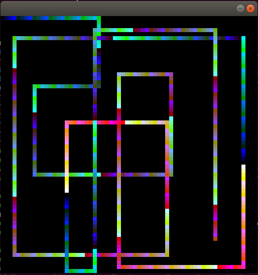

# 6502 Emulator

## What
A 6502 emulator which has been designed with a focus on readability rather than performance. It supports all documented opcodes other than BRK and RTI because traditional interupts are not supported.  Unit tests are included which test each instruction.

If you're looking for something to run games on this isn't for you.  If however you want to get a reasonable understanding of how a processor works and/or get to grips with an Assembly language then it may be of interest.

## Build

This has only been tested on Linux (Ubuntu 18.04).  There are no Linux specific dependencies though so in theory it should be buildable on Windows too.

* Make sure you've CMake 3.13 or higher installed
* Clone this repo
* CD to the root of the repo

```
$ cmake .
$ make
$ ./6502_emulator
```

When run this will load and run the _sample/a.o65_ binary and run it.

If you want to run a binary of a different name just update the path in _src/main.cpp_.  Feel free to submit a PR if you want specify the path to the binary on the command line ;)

## Memory Layout

There is 64KB of memory and this is broken into 

0x0000 - 0x05FF - Free

0x0600 - 0xDFFF - Program - always make sure to assemble programs for this address

0xE000 - 0xF000 - Video 

0xF001 - 0xF001 - Keyboard buffer

0xF002 - 0xFFFF - Free

### Video 

Resolution of the "attached display" is 64 * 64, so 4096 bytes.  Each "pixel" is blown up to be 8 pixels in size so things are nice and blocky.  

Writing a byte to 0xE000 will draw a pixel at the top left and at byte at 0xF000 will display at the bottom right.

Each pixel can be one of 256 colours where bits:

* 0-1 are blue  
* 2-4 are green
* 5-7 are red

### Keyboard

The last key pressed is stored to 0xF001 and it's up to your programs to clear this out after reading if you don't want to repeatedly read the same keypress.

SDL is used for reading key presses and the code for each key is https://wiki.libsdl.org/SDLScancodeLookup.  Only key presses where the code is <= 0xFF are logged.

## Sample

The _sample/draw.s_ file contains well commented 6502 assembly code for a simple program which allows you to draw multi-coloured lines with your cursor keys.  What fun!

The binary is checked in but if you make changes it can be recompiled using XA with:

```
$ xa draw.s -v -bt 1536
```

1536 is decimal for 0x600, i.e. the start of the program address space.

Exit the application by pressing the Esc key (there is nothing listening for Window close requests).  It'll use a full CPU so don't leave it running while you're watching a film ;)




